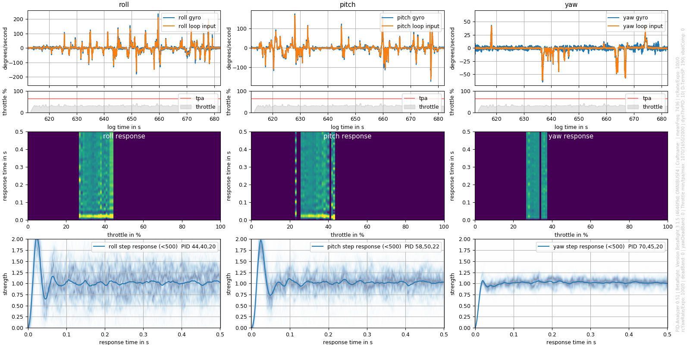
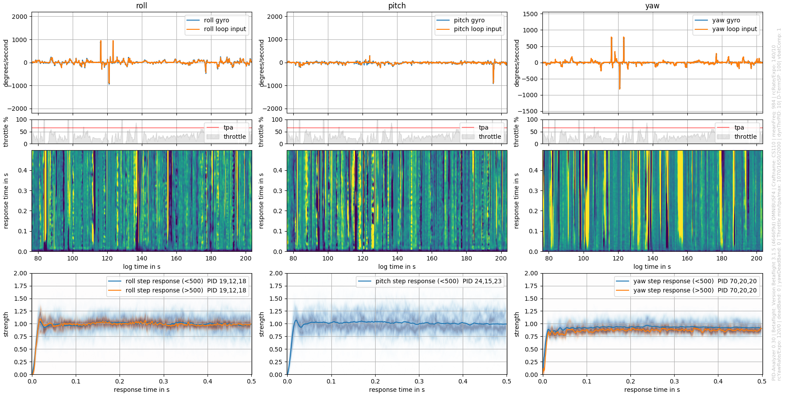

### PID-Analyzer 0.4 is online!
- Now with noise analysis ([see wiki](https://github.com/Plasmatree/PID-Analyzer/wiki/Noise-analysis))
- scaled down plot window size, better if you are using it on a screen <FHD
- you can choose not to display the plot window at all. Useful for files with lots of sublogs. Also saves on ram.
- Now two images save automatically (PID and noise plot)


# PID-Analyzer

This program reads Betaflight blackbox logs and calculates the PID step response. It is made as a tool for a more systematic approach to PID tuning.

The step response is a characteristic measure for PID performance and often referred to in tuning techniques.
For more details read: https://en.wikipedia.org/wiki/PID_controller#Manual_tuning 
The program is Python based but utilizes Blackbox_decode.exe from blackbox_tools (https://github.com/cleanflight/blackbox-tools) to read logfiles.

As an example: 
This was the BF 3.15 stock tune (including D Setpoint weight) on my 2.5" CS110: 


This a nice tune I came up with after some testing: 


You can even use angle mode, the result should be the same!
The program calculates the system response from input (PID loop input = What the quad should do) and output (Gyro = The quad does). 
Mathematically this is called deconvolution, which is the invers to convolution: Input * Response = Output. 
A 0.5s long response is calculated from a 1.5s long windowed region of interest. The window is shifted roughly 0.2s to calculate each next response. 
From a mathematical point of view this is necessary, but makes each momentary response correspond to an interval of roughly +-0.75s.
 
Any external input (by forced movement like wind) will result in an incomplete system and thus in a corrupted response. 
Based on RC-input and quality the momentary response functions are weighted to reduces the impact of corruptions. Due to statistics, more data (longer logs) will further improve reliability of the result. 

If D Setpoint Transition is set in Betaflight, your tune and thus the response will differ for high RC-inputs. 
This fact is respected by calculating separate responses for inputs above and below 500 deg/s. With just moderate input, you will get one result, if you also do flips there will be two.

Keep in mind that if you go crazy on the throttle it will cause more distortion.  If throttle-PID-attenuation (TPA) is set in Betaflight there will be a different response caused by a dynamically lower P. 
This is the reason why the throttle and TPA threshold is additionally plotted.

The whole thing is still under development and results/input of different and more experienced pilots will be appreciated!

## Requirements

To install required Python libraries, view the list of packages in `requirements.txt` or simply run:

```
sudo apt-get install python3-pip python3-tk
sudo pip3 install -r requirements.txt
```

## How to use this program:
1. Record your log. Logs of 20s seem to give sufficient statistics. If it's slightly windy, longer logs can still give reasonable results. You can record multiple logs in one session: Each entry will yield a seperate plot.
2. Place your logfiles, `blackbox_decode.exe` ([Windows download](https://github.com/cleanflight/blackbox-tools/releases/download/v0.4.3/blackbox-tools-0.4.3-windows.zip)) and `PID-Analyzer.exe` https://github.com/Plasmatree/PID-Analyzer/wiki/Noise-analysis in the same folder. You can also specify where to find these executables via command-line flags.
3. Run `PID-Analyzer.exe` (this takes some seconds, it sets up a complete virtual python environment). Either interactively enter your `.BBL` files (drop one or more logs into cmd), or pass your `.BBL` file(s) via flags, like `PID-Analyzer --log one.BBL --log two.BBL` directly when run in cli mode.
4. The logs are separated into temp files, read, analyzed and temp files deleted again.
5. A plot window opens and a `.png` image is saved automatically in the folder correspoding to you entered name (default is `\tmp`).

The windows executable includes a virtual python environment and only requires you to drag and drop your Betaflight blackbox logfile into the cmd window.


In case of problems (if the cmd closes for example), please report including the log file.

Tested on Win7/10 and MacOS 10.10, with 3.15/3.2/3.3 logs.


Happy tuning,

Flo

