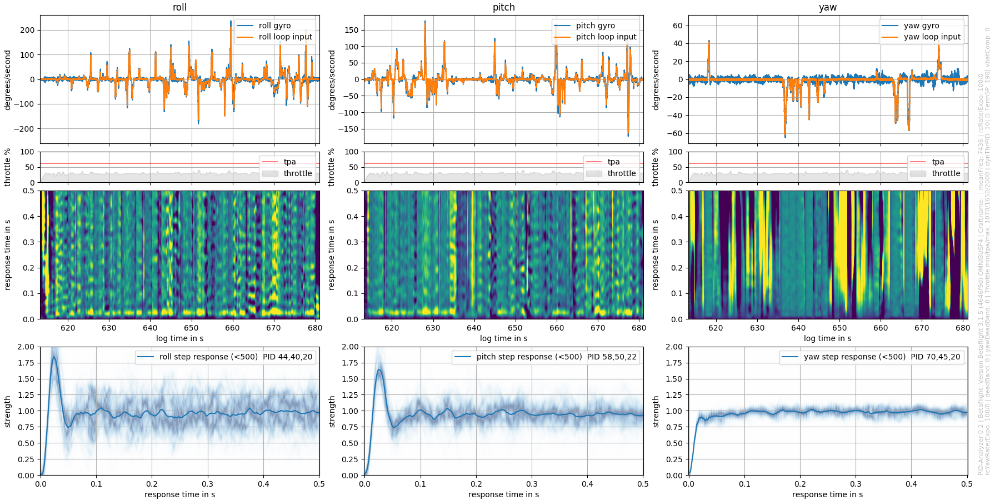

# PID-Analyzer

This program reads Betaflight blackbox logs and calculates the PID step response. It is made as a tool for a more systematic approach to PID tuning.

The step response is a characteristic measure for PID performance and often referred to in tuning techniques.
For more details read: https://en.wikipedia.org/wiki/PID_controller#Manual_tuning 
The program is Python based but utilizes Blackbox_decode.exe from blackbox_tools (https://github.com/cleanflight/blackbox-tools) to read logfiles.

It calculates the system response from input (PID loop input = What the quad should do) and output (Gyro = The quad does). 
Mathematically this is called deconvolution, which is the invers to convolution: Input * Response = Output. 
A 0.5s long response is calculated from a 1.5s long windowed region of interest. The window is shifted roughly 0.2s to calculate each next response. 
From a mathematical point of view this is necessary, but makes each momentary response correspond to an interval of roughly +-0.75s.
 

 
Any external input (by forced movement like wind) will result in an incomplete system and thus in a corrupted response. 
Based on RC-input and quality the momentary response functions are weighted to reduces the impact of corruptions. Due to statistics, more data (longer logs) will further improve reliability of the result. 

If it is set in Betaflight the P and I value of the PID will be different for high RC-inputs. This causes a different response. 
This fact is respected by calculating separate responses for inputs above and below 500 deg/s. With just moderate input, you will get one result, if you also do flips there will be two.

Keep in mind that if you go crazy on the throttle it will cause more distortion.  If throttle-PID-attenuation (TPA) is set in Betaflight there will even be a different response caused by a dynamically lower P. 
This is the reason why the throttle and TPA threshold is additionally plotted.

The whole thing is still under development and results/input of different and more experienced pilots will be appreciated!
 
How to use this program:
1. Record your log. Logs of 20s seem to give sufficient statistics. If it's slightly windy, longer logs can still give reasonable results. You can record multiple logs in one session: Each entry will yield a seperate plot. 
2. Place your logfiles, [blackbox_decode.exe](https://github.com/cleanflight/blackbox-tools/releases/download/v0.4.3/blackbox-tools-0.4.3-windows.zip) and [PID-Analyzer.exe](http://bit.ly/PID-Analyzer) in the same folder.
3. Run PID_analyzer.exe (this takes some seconds, it sets up a complete virtual python environment)
4. Drag and drop your file into the command window and press enter
5. Type in an optional name that will be appended to the log name. Or don't. Press Enter.
6. The logs are separated into temp files, read, analyzed and temp files deleted again. 
7. A plot window opens and a .png image is saved automatically

The windows executable includes a virtual python environment and only requires you to drag and drop your Betaflight blackbox logfile into the cmd window. 

In case of problems (if the cmd closes for example), please report including the log file.
It's only tested on Win10 and with 3.15/3.2 logs yet.

Happy tuning,

Flo

